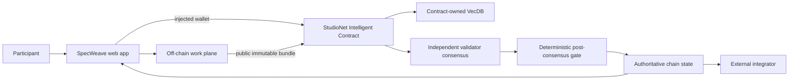

# SpecWeave — Architecture

## 1. Architectural thesis

SpecWeave is a release gate for standards that are drafted off-chain in Git or documents. A version candidate submits a commit-pinned manifest of changed clauses. VecDB retrieves semantically overlapping accepted clauses from anywhere in the standard, catching conflicts that a line diff misses. GenLayer validators decide whether the candidate is coherent with the existing standard, intentionally supersedes named clauses, duplicates an existing rule or requires revision. The accepted canonical version hash is then advanced on-chain.

The architecture preserves one boundary:

> High-volume creation/observation happens off-chain; **which commit-pinned specification release becomes the canonical version and which earlier clauses it supersedes** becomes authoritative only after a bounded GenLayer flow.

## 2. System context



Backend/service output is never the authoritative answer.

## 3. Components

### Web application

- domain workflow;
- public browsing;
- injected wallet;
- artifact preparation;
- live contract reads;
- transaction/finality rail;
- semantic-memory display;
- authoritative decision/history pages.

### Off-chain work plane

Git-first frontend with no application database in MVP. Next.js server routes can fetch/cache commit-pinned raw GitHub manifests and clause files but never mutate Git or sign chain transactions. A small CLI script can generate the bounded release manifest.

### Intelligent Contract

Standard charter; canonical version digest; clause registry; semantic clause vectors; release proposals; supersession graph; consensus coherence result; version receipts.

### Contract-owned semantic memory

Every accepted clause gets an embedding of clause ID, section path, normative strength (MUST/SHOULD/MAY), defined terms and bounded text. A release candidate embeds each changed clause and retrieves up to 5 semantically overlapping accepted clauses across the entire standard. Exact referenced clause IDs are always included regardless of distance.

## 4. Data ownership

| Data | Source of truth | Mutable | Consensus input |
|---|---|---:|---:|
| Draft/high-volume work | Off-chain service | Yes | No, until frozen |
| Frozen public artifact | Artifact store + chain digest | No | Yes |
| Rules/charter/rubric version | Contract | Versioned | Yes |
| VecDB pointer/vector | Contract | Append by invariant | Yes, bounded retrieval |
| Final status/receipt | Contract | Terminal/versioned | N/A; output |
| UI cache | Browser/service | Yes | Never authoritative |
| Deployment facts | Repository docs + explorer/chain | Append | N/A |

## 5. Domain contract model

- Standard { steward, name, charter_url, charter_digest, canonical_version, canonical_manifest_digest, clause_count }
- Clause { standard_id, clause_id, section_path, normative_level, text, source_url, source_digest, introduced_version, superseded_version, active }
- ReleaseProposal { standard_id, proposer, base_version, commit_sha, manifest_url, manifest_digest, changed_clause_count, status, clause_decisions_json, rationale, proposed_at, reviewed_at }
- VectorPointer { clause_record_id, standard_id, normative_code }

## 6. Public contract surface

- create_standard(name, charter_url, charter_digest, initial_manifest_url, initial_manifest_digest) -> standard_id
- set_editor(standard_id, editor_address, enabled)
- register_initial_clause(standard_id, clause_id, section_path, normative_level, text, source_url, source_digest) -> clause_record_id
- propose_release(standard_id, base_version, commit_sha, manifest_url, manifest_digest, changed_clause_count) -> proposal_id
- review_release(proposal_id) -> clause decisions
- finalize_release(proposal_id) -> canonical version
- cancel_release(proposal_id)
- get_standard(standard_id)
- get_clause(clause_record_id)
- get_release(proposal_id)
- preview_overlaps(proposal_id, changed_clause_index, k)

Third-party consumers must be able to reconstruct the final status from views alone.

## 7. End-to-end sequence

```mermaid
sequenceDiagram
    participant P as Participant
    participant UI as Web
    participant OFF as Off-chain plane
    participant IC as Contract
    participant DB as VecDB
    participant VAL as Validators

    P->>UI: perform normal domain work
    UI->>OFF: save/aggregate/prepare
    OFF-->>UI: immutable public bundle + digest
    P->>UI: approve on-chain escalation
    UI->>IC: injected-wallet submit
    IC->>IC: deterministic preflight/version checks
    IC->>DB: bounded KNN
    DB-->>IC: eligible related memory
    IC->>VAL: rules + evidence + memories
    VAL->>VAL: independent fetch + judgment
    VAL-->>IC: equivalent bounded result
    IC->>IC: validate result + apply deterministic transition
    IC-->>UI: finalized transaction
    UI->>IC: re-read authoritative record
```

## 8. Semantic-memory path

Embedding inputs:

Every accepted clause gets an embedding of clause ID, section path, normative strength (MUST/SHOULD/MAY), defined terms and bounded text. A release candidate embeds each changed clause and retrieves up to 5 semantically overlapping accepted clauses across the entire standard. Exact referenced clause IDs are always included regardless of distance.

Decision prompt fields:

- standard charter
- current canonical version
- changed clause ID/section/normative level/text
- explicit supersedes list
- exact referenced clauses
- retrieved semantically overlapping accepted clauses
- commit-pinned source evidence

The architecture deliberately separates **selection** from **judgment**. A memory hit is never enough to authorize the final transition.

## 9. Off-chain API/service boundary

Expected endpoints/categories:

- `GET /api/github/raw?url=`
- `GET /api/github/manifest?url=`
- `POST /api/manifest/validate`

If this project is frontend-first/no persistent database, those endpoints are limited metadata/cache proxies rather than an authority.

### Artifact freeze flow

```text
draft mutable data
  -> validate/publicity check
  -> canonical serialization
  -> SHA-256 digest
  -> immutable public object/ref
  -> user sees digest + preview
  -> injected-wallet chain submission
```

Once the digest is submitted, editing produces a new object/digest rather than replacing the old evidence.

## 10. Route architecture

| Route | Domain screen | Primary action |
| --- | --- | --- |
| / | Standard reader | Open clause/release |
| /clauses | Clause index | Open clause |
| /releases/new | Release desk | Propose release |
| /releases/[id]/diff | Semantic diff view | Run review |
| /releases/[id]/conflicts | Conflict matrix | Inspect conflict |
| /graph | Supersession graph | Inspect lineage |
| /versions | Version ledger | Open canonical receipt |
| /canonical | Implementation-facing receipt | Copy |

The full layout rules are in `ui/ux.md`.

## 11. State transition principles

Status vocabulary:

```text
DRAFT_OFFCHAIN, PROPOSED, UNDER_REVIEW, ACCEPTABLE, REVISION_REQUIRED, REJECTED, CANONICAL, SUPERSEDED
```

Implement an explicit transition table in code/tests. Do not infer allowed transitions from ordering above.

A final record is immutable. Corrections create an explicit version/supersession/new case.

## 12. Consensus boundary

Decision:

> For each changed clause, do validators agree it is COHERENT_NEW, COHERENT_SUPERSESSION, DUPLICATE_RULE, SEMANTIC_CONFLICT or INSUFFICIENT_CONTEXT relative to the current canonical standard? The release is ACCEPTABLE only if every changed clause is coherent and all supersessions are explicit and bounded.

### Before nondeterminism

- role/identity;
- record exists;
- state allows review;
- base version current;
- sizes/counts bounded;
- immutable evidence refs syntactically valid;
- required enumerations allowed.

### Inside nondeterminism

- independently fetch public evidence where needed;
- interpret semantic evidence;
- compare retrieved memories for applicability;
- return fixed enums/bands/IDs.

### After nondeterminism

- validate all returned IDs/enums;
- re-check base state;
- deterministic arithmetic/state changes;
- memory insertion;
- events/counters.

## 13. Security boundaries

### User/caller

Cannot make user-submitted prose authoritative external evidence by assertion.

### Public evidence

Potential prompt injection. Bound and frame as data. Unavailable evidence fails closed.

### Semantic memory

Public and fallible as precedent/context. Namespace/version filters are deterministic.

### Off-chain service

Can coordinate; cannot sign/finalize chain.

### Wallet

Actual provider account/network immediately before signature is authoritative.

### Runtime

Finalized transaction status alone is not success; GenVM execution must be inspected.

## 14. Failure semantics

| Failure | Result |
|---|---|
| Artifact service unavailable before freeze | no submission |
| Evidence URL unavailable during consensus | explicit insufficient/failure; no positive state |
| No eligible VecDB memories | proceed only if domain rules permit; show “no related memory” |
| Validator disagreement | no unauthorized final state |
| Stale base version | reject before consensus |
| FINALIZED + rollback | show failure, re-read state |
| Malformed live read | unavailable, not empty/default |
| Backend stale cache | chain wins |

## 15. Scaling model

The product scales because the repeated/high-volume work is outside consensus.

- Paginate chain lists.
- Keep stored strings bounded.
- Use small vector pointers.
- Use deterministic domain filters around KNN.
- Keep validator context small.
- Split oversized cases/releases rather than raising every bound.
- Benchmark actual runtime before claiming large VecDB scale.

## 16. Observability

Log without secrets:

- artifact digest;
- record/case IDs;
- tx hashes;
- wallet chain changes;
- finality state;
- GenVM result;
- source fetch failure category;
- selected memory IDs;
- contract status after re-read.

## 17. Project invariants

- Release base_version must equal current canonical version at review/finalization.
- All GitHub source URLs must be commit-pinned when used as immutable evidence.
- Active clause IDs are unique within a standard.
- COHERENT_SUPERSESSION must name active clause IDs and deterministically deactivate them only on finalization.
- No clause update occurs if any changed clause is conflict/revision-required.
- Similarity cannot create an implicit supersession.

## 18. Concrete test scenario

Mini protocol spec has clause 4.2 `Clients SHOULD retry after 30s` and clause 9.1 `Clients MUST NOT retry authentication failures`. New clause changes retry behavior to `MUST retry all failures after 10s`, creating distant semantic conflict.

## 19. Reference end-to-end demo

Seed an initial mini-standard with 12 clauses, propose a commit-pinned release changing three clauses, surface one distant semantic conflict, revise the manifest to make supersession explicit, then finalize the coherent release and show canonical version advancement.
